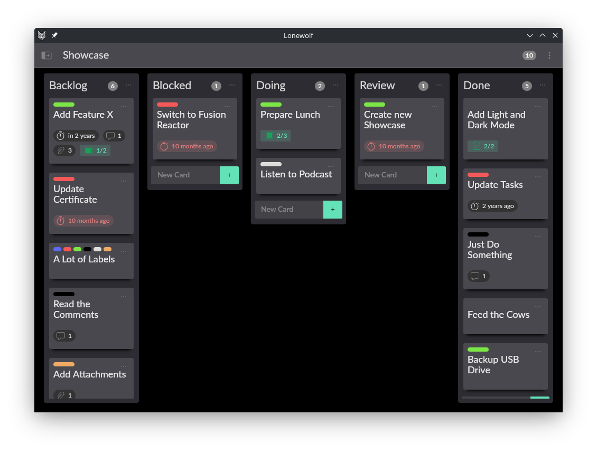
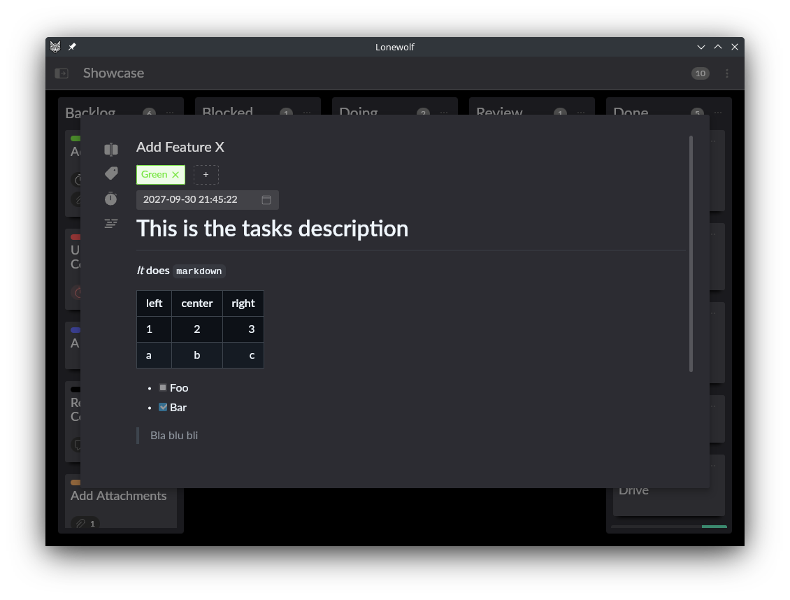

# Lonewolf

Organize and track your tasks with ease and flexibility. Lonewolf is a productivity application based on the principles of Kanban.

## Features

* Manages lists
* Create cards
* Organize cards with labels
* Set due dates for yourself
* Add attachments
* Write descriptions of your tasks in markdown
* Split up larger tasks with check lists
* Keep your thoughts by adding comments for your future self




## Install

### Linux

[Lonewolf is distributed as a flatpak via flathub](https://flathub.org/apps/site.someones.Lonewolf). You can use [Discover](https://apps.kde.org/de/discover/), [GNOME Software](https://apps.gnome.org/Software/) or the command line untility `flatpak`.

### Windows

There is currently no build of Lonewolf distributed for Windows. If you want to run Lonewolf on Windows it must be built from source (see below for informations on how to build Lonewolf).

### MacOS

There is currently no build of Lonewolf distributed for macOS. If you want to run Lonewolf on macOS it must be built from source (see below for informations on how to build Lonewolf).

## Development

It seams you are interested in the development of Lonewolf, GREAT! Lonewolf is written in typescript, build with vue 3 and uses naive-ui as ui toolkit.

Lonewolf is split in to three parts:

* lonewolf: The core library where all the components and logic live.
* lonewolf-web: The project which builds lonewolf as a web application. It also contains web specific components and logic. This project can be used to speed up development since it is easier to run and build.
* lonewolf-tauri: The project which builds lonewolf as a desktop app, using the power of [Tauri](https://tauri.app/). This project contains additional components and logic specific to the desktop version od tauri. The flatpak hosted on flathub is build of this project.

Lonewolf uses `make` as its main build tool, so everything you might want to run is implemented as a make target in the corresponding project directory. The projects root directory also contains a `Makefile` which wraps some of the project specific make targets within a podman container. If you do not want to run the commands in a container just run them with `make` from the projects directory.

### Live Development

To jump directly into developing you can run the web with a hot reloading server by executing:
```
make dev-web
```


The same thing exists for the desktop version:

The Tauri development version needs to be run on linux with a running Xorg server. Since this runs Lonewolf in a container not everything works as it would when running locally (eg. opening attachments calls xdg-open in the background but this is not available within the container). If this does not work with your environment you can allways run the `dev` target within the projects root directory directly.

**Also make sure that `xhost` is installed!**
```
make dev-tauri-X
```

### Validation
To make it easier to make sure that your changes pass all checks in both projects a target exists `make check test` to run linting, type checking and unit testing.

### Building

Projects should be build from their specific build targets. If you want to build from within a container, there are two targets `shell-web` and `shell-tauri` to jump in to a containerized shell from which `make build` and all other targets can be executed.

## Other

There are a few other targets to help you developing

### Project Management

To generate a png of the current state of the Lonewolf project run:

```
make Lonewolf.png
```


## License

Lonewolf - Organize and track your tasks with ease and flexibility.
Copyright (C) 2023 Mario Aichinger <aichingm@gmail.com>

This program is free software: you can redistribute it and/or modify it under the terms of the GNU General Public License as published by the Free Software Foundation, either version 3 of the License, or (at your option) any later version.

This program is distributed in the hope that it will be useful, but WITHOUT ANY WARRANTY; without even the implied warranty of MERCHANTABILITY or FITNESS FOR A PARTICULAR PURPOSE. See the GNU General Public License for more details.

You should have received a copy of the GNU General Public License along with this program. If not, see <https://www.gnu.org/licenses/>.


Created and distributed under the terms of the [GNU General Public License v3.0](https://spdx.org/licenses/GPL-3.0-or-later.html)
