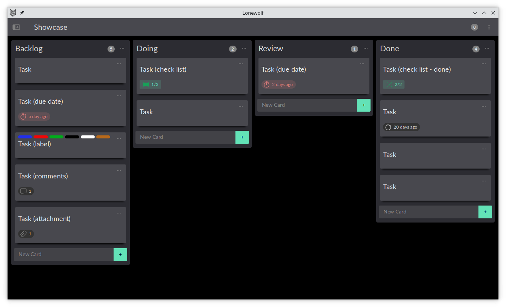
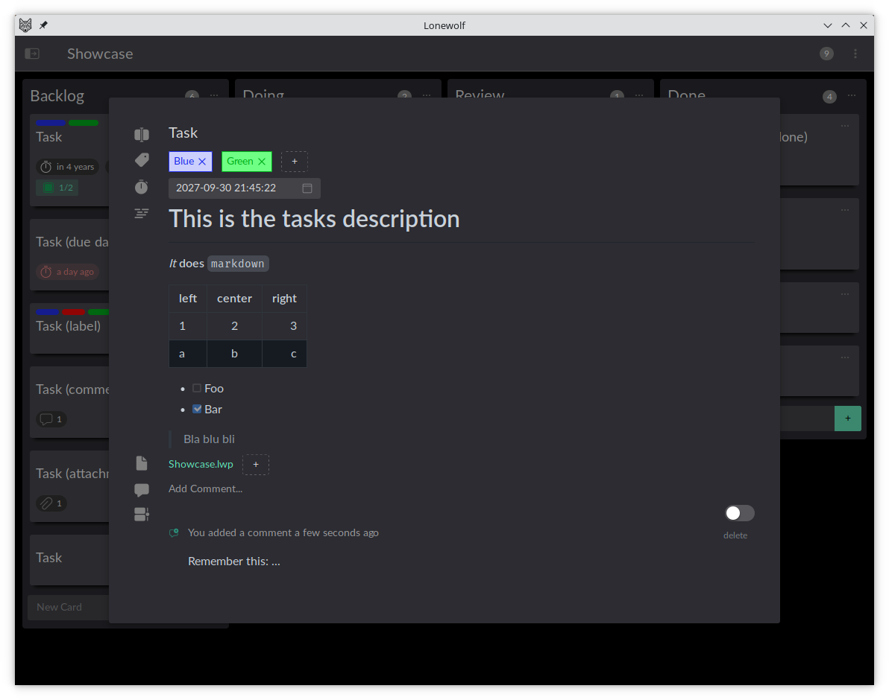

# Lonewolf

Organize and track your tasks with ease and flexibility. Lonewolf is a productivity application based on the principles of Kanban.

## Features

* Manages lists
* Create cards
* Organize cards with lables
* Set due dates for yourself
* Add attchments
* Write descripotions of your tasks in markdown
* Split up larger tasks with check lists
* Keep your thoughts by adding comments for your future self





## Development Setup

It seams you are interested in the development of Lonewolf, GREAT! Lonewolf is written in typescript, build with vue 3 and uses naive-ui as ui toolkit.  
The desktop version of Lonewolf is build on top of Tauri (a more light weight alternative to electron written in rust).

Lonewolf uses make as build tool, so everything you might want to run is implemented as a make target.  
To run most of the make targets only a podman compatible (eg. docker) container engine is needed.

To build the development container run

```
make image-dev
```

This image is needed by most make targets, so make sure it is build before running running any of them.


## Live Development

Lonewolf can be run in to versions a web and a Tauri version.

The web version can be accessed from a web browser and supports hot reloading
```
make dev-web
```

The Tauri development version needs to be run on linux with a running Xorg server. Since this runs Lonewolf in a container not everything works as it would when running locally (eg. opening attachments calls xdg-open in the background but this is not available within the container)

**Also make sure that `xhost` is installed!**
```
make dev-tauri-X
```

## Validation

To validate the functionality of your changes you can and should run

```
make check test
```

to run linting, type checks and unit tests.

There are also targets to only run validation for the web or the Tauri version:

```
make lint-web type-check-web test-web-unit
```

```
make lint-tauri type-check-tauri test-tauri-unit
```

## Building

How to build different versions of Lonewolf:

```
make build/web
make build/lonewolf-dev.bin
make build/lonewolf.flatpak
```

To build the flatpak bundle the `lonewolf:flatpak` image is needed. This can be built with:

```
make image-flatpak
```

## Other

There are a few other targets to help you developing

### Project Management

To generate a png of the current state of the Lonewolf project run:

```
make build/Lonewolf.png
```

### Installing node modules

```
make npm-install[-(web|tauri)]
```

### Running a shell in the container

```
make shell[-(web|tauri)]
```

## License

Lonewolf - Organize and track your tasks with ease and flexibility.
Copyright (C) 2023 Mario Aichinger <aichingm@gmail.com>

This program is free software: you can redistribute it and/or modify it under the terms of the GNU General Public License as published by the Free Software Foundation, either version 3 of the License, or (at your option) any later version.

This program is distributed in the hope that it will be useful, but WITHOUT ANY WARRANTY; without even the implied warranty of MERCHANTABILITY or FITNESS FOR A PARTICULAR PURPOSE. See the GNU General Public License for more details.

You should have received a copy of the GNU General Public License along with this program. If not, see <https://www.gnu.org/licenses/>.


Created and distributed under the terms of the [GNU General Public License v3.0](https://spdx.org/licenses/GPL-3.0-or-later.html)
